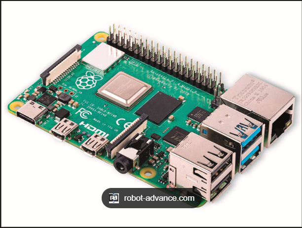
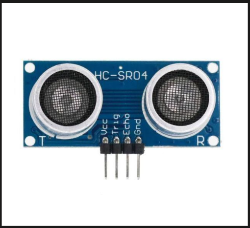
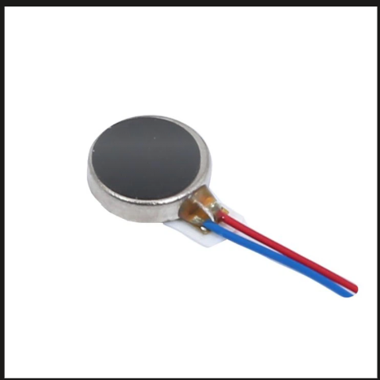
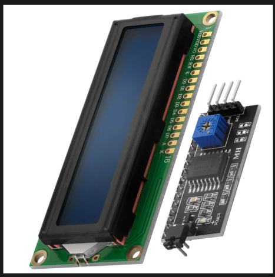
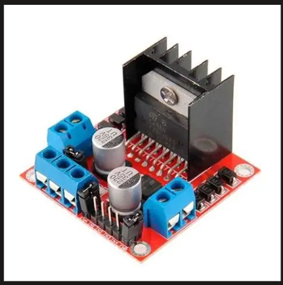
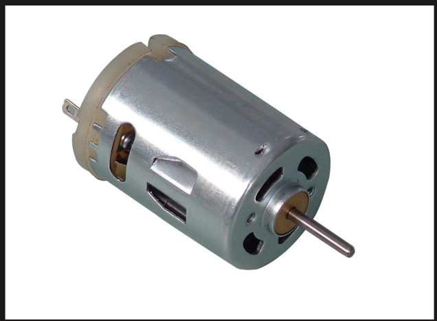
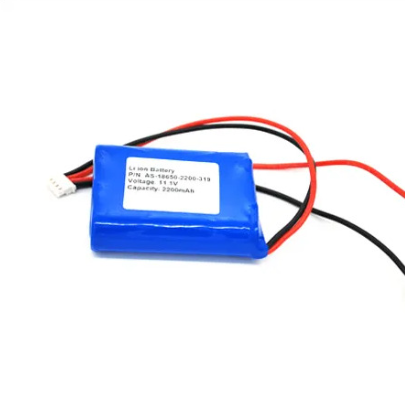

# ADAS-Inspired Driver Assistance System

## Semester 6 Mini Project

### Overview

This project was developed as part of the Semester 6 Mini Project for the Bachelor of Technology in Electronics and Communication Engineering.

The system demonstrates the fundamental concepts behind Advanced Driver Assistance Systems (ADAS) by integrating computer vision, obstacle detection, haptic feedback, and embedded processing into a single platform. The objective is to improve driver awareness by monitoring lane position and detecting nearby obstacles in real time.

Using a Raspberry Pi, a USB camera, an ultrasonic sensor, an LCD display, and a haptic feedback mechanism, the system continuously analyzes the vehicle's surroundings and alerts the driver whenever a potential hazard is detected.

---

## Features

- Lane departure detection using OpenCV
- Real-time lane monitoring through computer vision
- Obstacle detection using HC-SR04 ultrasonic sensor
- Haptic vibration alerts for driver awareness
- LCD-based visual warning system
- Multi-threaded architecture for simultaneous sensor and vision processing
- Raspberry Pi-based embedded implementation
- Real-time decision-making and alert generation

---

## System Architecture

The system consists of two primary subsystems:

### 1. Lane Detection Module

The USB camera captures real-time video frames. OpenCV image processing techniques such as grayscale conversion, Gaussian filtering, edge detection, region-of-interest masking, and Hough Line Transform are used to identify lane boundaries. The system determines whether the vehicle has deviated significantly from the detected lane center and generates a lane departure alert when necessary.

### 2. Obstacle Detection Module

The HC-SR04 ultrasonic sensor continuously measures the distance between the vehicle and obstacles ahead. When an object is detected within the predefined safety threshold, the system generates an obstacle warning.

### Alert Mechanism

When either a lane departure event or an obstacle is detected:

- The haptic motor vibrates to provide immediate feedback.
- The LCD display shows the corresponding warning message.
- The system continues monitoring until safe conditions are restored.

---

## Hardware Components

### Raspberry Pi 4

### USB Webcam

### HC-SR04 Ultrasonic Sensor

### Haptic Motor Module

### I2C LCD Display (16x2)

### L298N Motor Driver

### DC Motors

### Power Supply


---

## Software Tools and Libraries

- Python
- OpenCV
- NumPy
- RPi.GPIO
- RPLCD
- SMBus2
- Threading

---

## Project Structure

```text
ADAS-Mini-Project/
│
├── main.py
├── lane_detection.py
├── ultrasonic.py
├── lcd_display.py
├── requirements.txt
├── README.md
└── images/
```

### File Description

| File | Description |
|--------|-------------|
| main.py | Main control program and system integration |
| lane_detection.py | Computer vision and lane detection logic |
| ultrasonic.py | Obstacle detection using ultrasonic sensor |
| lcd_display.py | LCD interface functions |
| requirements.txt | Python package dependencies |

---

## Working Principle

1. The USB camera continuously captures road images.
2. OpenCV processes each frame and detects lane boundaries.
3. The ultrasonic sensor measures the distance to obstacles ahead.
4. Sensor and vision modules run simultaneously using separate threads.
5. If a lane departure or obstacle is detected:
   - The haptic motor activates.
   - A warning message is displayed on the LCD.
6. The system returns to the safe state once the hazard is no longer present.

---

## Applications

- Driver Assistance Systems
- Automotive Safety Research
- Embedded Vision Systems
- Intelligent Transportation Systems
- Academic and Educational Projects

---

## Learning Outcomes

Through this project, valuable practical experience was gained in:

- Embedded Systems Design
- Raspberry Pi Development
- Sensor Interfacing
- Computer Vision using OpenCV
- Real-Time Processing
- Multi-Threaded Programming
- Automotive Safety Technologies

---

## Future Improvements

- Steering control integration
- Motor speed control based on obstacle distance
- Deep-learning-based lane detection
- Traffic sign recognition
- GPS and navigation support
- Cloud-based monitoring and analytics

---

## Project Outcome

The project successfully demonstrated an ADAS-inspired driver assistance system capable of lane departure monitoring and obstacle detection with real-time haptic and visual feedback. The implementation highlights the integration of embedded systems and computer vision techniques for improving driver awareness and road safety.

---

## Authors

Dennis Mampilly and Team

Semester 6 Mini Project

Department of Electronics and Communication Engineering

Rajiv Gandhi Institute of Technology (RIT), Kottayam
